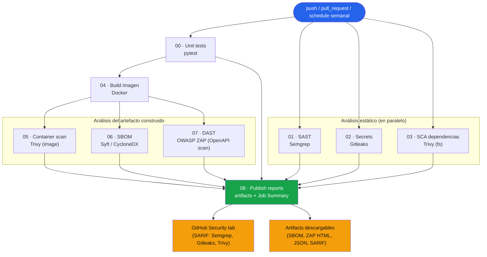

# Fleet Compliance API — Pipeline DevSecOps alineado con la CRA


Proyecto de portafolio: un pipeline DevSecOps completo sobre GitHub Actions,
construido alrededor de una API REST realista, y documentado línea por línea
contra los requisitos de la **Cyber Resilience Act (CRA)** de la UE
(Reglamento (UE) 2024/2847).

> 🎓 Contexto: graduado en Ingeniería Informática, cursando un máster en
> ciberseguridad. Este repositorio es una pieza de portafolio técnico — el
> código de la app es intencionadamente pequeño; el peso del proyecto está
> en el pipeline, la documentación de seguridad y el razonamiento sobre
> *por qué* cada control existe, no solo *qué* herramienta lo implementa.

## Índice

- [Qué hay aquí](#qué-hay-aquí)
- [La aplicación: Fleet Compliance API](#la-aplicación-fleet-compliance-api)
- [El pipeline](#el-pipeline)
- [Diagrama del pipeline](#diagrama-del-pipeline)
- [Vulnerabilidades intencionadas](#vulnerabilidades-intencionadas)
- [Cómo reproducirlo](#cómo-reproducirlo)
- [Capturas esperadas](#capturas-esperadas)
- [Estructura del repositorio](#estructura-del-repositorio)
- [Alineación con la CRA](#alineación-con-la-cra)
- [Qué añadiría con más tiempo](#qué-añadiría-con-más-tiempo)
- [Qué aprendí construyendo esto](#qué-aprendí-construyendo-esto)

---

## Qué hay aquí

1. **Una API REST realista** ([`app/`](app/)) con autenticación JWT,
   persistencia en SQLite y 3 vulnerabilidades sencillas, deliberadas y
   documentadas.
2. **Un pipeline de GitHub Actions con 9 jobs** ([`.github/workflows/devsecops-pipeline.yml`](.github/workflows/devsecops-pipeline.yml))
   que cubre SAST, detección de secretos, SCA, escaneo de imagen de
   contenedor, DAST y generación de SBOM — cada uno comentado explicando
   *qué hace y por qué está ahí*.
3. **[`CRA_MAPPING.md`](CRA_MAPPING.md)**: cada etapa del pipeline conectada
   con un artículo o anexo concreto de la Cyber Resilience Act.
4. **[`docs/VULNERABILITIES.md`](docs/VULNERABILITIES.md)**: cada
   vulnerabilidad con su CWE, el job que la detecta, y el diff exacto para
   corregirla en un commit independiente.
5. **[`SECURITY.md`](SECURITY.md)**: una política real de divulgación
   coordinada de vulnerabilidades (CVD), porque la CRA la exige y porque un
   repo de seguridad sin ella no predica con el ejemplo.

## La aplicación: Fleet Compliance API

Deliberadamente **no** es otro to-do list. Es una API pequeña que resuelve
un problema real: un equipo de IT/Seguridad que opera una flota de
dispositivos conectados (sensores IoT, terminales POS, controladores
industriales...) necesita saber, en todo momento, **qué firmware corre cada
dispositivo** y detectar los que se han quedado atrás. Cada dispositivo
"hace check-in" contra un endpoint de heartbeat, igual que haría un agente
OTA (*over-the-air*) real.

No es casualidad que el dominio de la app sea justo esto: es literalmente el
tipo de sistema que la CRA obliga a las organizaciones a tener — inventario
de componentes y trazabilidad de versiones — aplicado a nivel de flota en
vez de a nivel de imagen de contenedor. La app y el pipeline que la rodea
cuentan la misma historia desde dos ángulos distintos.

**Stack:** Python 3.12 + FastAPI + SQLite + PyJWT + passlib(bcrypt).
Elegido sobre Node/Express porque el ecosistema de seguridad Python
(Semgrep, Trivy, Bandit-style rules) es el más maduro para demostrar SAST/SCA
en un proyecto de portafolio de ciberseguridad, y porque FastAPI genera
documentación OpenAPI automática (`/docs`) que sirve también como superficie
de pruebas para el DAST.

**Endpoints principales:**

| Método | Ruta | Descripción |
|---|---|---|
| `GET` | `/health` | Liveness check |
| `POST` | `/auth/token` | Login, devuelve un JWT |
| `POST` | `/devices` | Registra un dispositivo |
| `GET` | `/devices` | Lista los dispositivos del operador autenticado |
| `GET` | `/devices/search?q=` | Busca por asset tag / tipo de dispositivo ⚠️ *vulnerable, ver abajo* |
| `GET` | `/devices/{id}` | Detalle de un dispositivo |
| `POST` | `/devices/{id}/heartbeat` | Un dispositivo reporta su firmware actual |
| `PATCH` | `/devices/{id}` | Cambia el estado (`active`/`quarantined`/`decommissioned`) |
| `DELETE` | `/devices/{id}` | Da de baja un dispositivo |

## El pipeline

9 jobs, cada uno con permisos mínimos (`permissions:` explícito por job),
que se ejecutan en `push`/`pull_request` a `main`, bajo demanda
(`workflow_dispatch`) y semanalmente (`schedule`) para detectar CVEs nuevas
sin necesidad de un cambio de código:

| Job | Herramienta | Qué hace |
|---|---|---|
| `00 · Unit tests` | pytest | Valida corrección funcional (incluye tests de regresión de seguridad); `build-image` no arranca si esto falla |
| `01 · SAST` | [Semgrep](https://semgrep.dev/) | Analiza el código Python en busca de patrones inseguros (reglas OWASP Top 10 + reglas propias) |
| `02 · Secrets` | [Gitleaks](https://github.com/gitleaks/gitleaks) | Escanea todo el historial de git en busca de credenciales hardcodeadas |
| `03 · SCA` | [Trivy](https://aquasecurity.github.io/trivy/) (filesystem) | Analiza `requirements.txt` en busca de dependencias con CVEs conocidas |
| `04 · Build` | Docker | Construye la imagen una única vez y la comparte con los jobs siguientes como artifact |
| `05 · Container scan` | Trivy (image) | Analiza la imagen final (SO base + dependencias instaladas) |
| `06 · SBOM` | [Syft](https://github.com/anchore/syft) | Genera un SBOM CycloneDX de la imagen que realmente se desplegaría |
| `07 · DAST` | [OWASP ZAP](https://www.zaproxy.org/) (escaneo activo vía OpenAPI) | Levanta el contenedor, importa el spec OpenAPI que expone FastAPI y ataca activamente cada endpoint real (autenticado incluido) |
| `08 · Publish` | — | Descarga todos los informes, genera un resumen en el *Job Summary* y los publica como un único artifact consolidado |

Cada job de escaneo sube su resultado como **artifact descargable** y, cuando
el formato lo permite (SARIF), lo integra además en la pestaña
**Security → Code scanning** del repositorio — así los hallazgos aparecen
donde un revisor de GitHub esperaría encontrarlos, no solo en un log de CI.

## Diagrama del pipeline



## Vulnerabilidades intencionadas

Este repositorio ships con **3 vulnerabilidades sencillas y documentadas a
propósito**, para que el pipeline tenga algo real que detectar en su primera
ejecución (que se espera **en rojo**, deliberadamente — así se demuestra que
las puertas de seguridad funcionan de verdad):

| # | Vulnerabilidad | CWE | La detecta |
|---|---|---|---|
| 1 | Dependencia desactualizada — `PyYAML==5.3.1` ([CVE-2020-14343](https://nvd.nist.gov/vuln/detail/CVE-2020-14343)) | CWE-20 | Trivy (jobs 03/05) |
| 2 | Secreto de firma JWT y contraseña admin hardcodeados en `app/config.py` | CWE-798 | Gitleaks (job 02) |
| 3 | Inyección SQL en `GET /devices/search` (`app/database.py`) | CWE-89 | Semgrep (job 01) |

Escrito completo, con el diff exacto de cada fix y el commit sugerido, en
**[`docs/VULNERABILITIES.md`](docs/VULNERABILITIES.md)**.

## Cómo reproducirlo

### Localmente, sin Docker

```bash
git clone https://github.com/108M/Pipeline-DevSecOps.git
cd Pipeline-DevSecOps

python -m venv .venv
source .venv/bin/activate          # Windows: .venv\Scripts\activate

pip install -r app/requirements-dev.txt

# Tests (incluyen los tests de regresión de seguridad en app/tests/test_vulnerabilities.py)
pytest

# Levantar la API
uvicorn app.main:app --reload --port 8000
# Swagger UI en http://localhost:8000/docs
```

### Con Docker

```bash
docker compose up --build
# API disponible en http://localhost:8000
```

### El pipeline completo (en tu propio fork)

1. Haz fork de este repositorio.
2. Ve a la pestaña **Actions** y habilita los workflows.
3. Lanza el workflow manualmente (`workflow_dispatch`) o simplemente haz un
   push — la primera ejecución debería fallar en los jobs `01`, `02` y `03`
   por las 3 vulnerabilidades intencionadas.
4. Aplica los fixes de [`docs/VULNERABILITIES.md`](docs/VULNERABILITIES.md)
   uno por uno, en commits separados, y observa el pipeline volver a verde.
5. Revisa **Security → Code scanning** para ver los hallazgos de SARIF
   agregados por GitHub, y descarga el artifact
   `security-reports-<sha>` para ver el resumen consolidado.

> Nota: los jobs `05`, `06` y `07` requieren que Docker esté disponible en
> el runner — ya lo está por defecto en los runners `ubuntu-latest` alojados
> por GitHub, no hace falta configuración adicional.

## Capturas esperadas

Este repositorio se ha construido y documentado sin ejecutarlo todavía en
GitHub Actions (sin hacer push). La carpeta [`docs/screenshots/`](docs/screenshots/)
está preparada con la lista exacta de capturas a añadir tras la primera
ejecución real — pipeline en rojo, pipeline en verde tras los fixes, la
pestaña Security, los artifacts y el SBOM generado. Es el único paso manual
que queda para dejar el repositorio 100% completo de cara a un revisor.

## Estructura del repositorio

```
.
├── app/                          # Fleet Compliance API (FastAPI)
│   ├── main.py                   # Endpoints
│   ├── database.py               # Acceso a datos (contiene Vulnerabilidad 3)
│   ├── auth.py                   # JWT + hashing de contraseñas
│   ├── config.py                 # Configuración (contiene Vulnerabilidad 2)
│   ├── feature_flags.py          # Carga settings.yaml con PyYAML
│   ├── models.py                 # Esquemas Pydantic
│   ├── requirements.txt          # Contiene Vulnerabilidad 1 (PyYAML desactualizado)
│   ├── Dockerfile                # Build multi-stage, usuario no-root
│   └── tests/
│       ├── test_api.py           # Tests funcionales
│       └── test_vulnerabilities.py  # Tests de regresión de seguridad
├── .github/workflows/
│   └── devsecops-pipeline.yml    # Los 9 jobs del pipeline
├── .semgrep/custom-rules.yml     # Regla SAST propia (SQLi)
├── .gitleaks.toml                # Config de Gitleaks (extiende reglas por defecto)
├── .zap/rules.tsv                # Tuning del escaneo activo de ZAP (OpenAPI)
├── docs/
│   ├── VULNERABILITIES.md        # Las 3 vulnerabilidades + fixes exactos
│   └── screenshots/               # Capturas del pipeline en ejecución
├── CRA_MAPPING.md                # Mapeo pipeline <-> artículos de la CRA
├── SECURITY.md                   # Política de divulgación coordinada
└── docker-compose.yml            # Levantar la app localmente
```

## Alineación con la CRA

Resumen — el detalle completo, artículo por artículo, está en
[`CRA_MAPPING.md`](CRA_MAPPING.md):

- **SBOM** (job 06) → Anexo I, Parte II, punto 1.
- **Gestión de vulnerabilidades en dependencias** (jobs 03/05 + ejecución
  semanal) → Anexo I, Parte II, punto 2.
- **Pruebas de seguridad efectivas y periódicas** (jobs 01/02/07) → Anexo I,
  Parte II, punto 3.
- **Divulgación pública de vulnerabilidades corregidas** →
  `docs/VULNERABILITIES.md`, Anexo I, Parte II, punto 4.
- **Política de divulgación coordinada** → `SECURITY.md`, Anexo I, Parte II,
  punto 5.
- **Configuración segura por defecto** → gap documentado a propósito
  (Vulnerabilidad 2) para mostrar cómo detectarlo y corregirlo, Anexo I,
  Parte I, punto 2(b).

## Qué añadiría con más tiempo

Lista honesta de lo que dejaría un producto real más cerca de conformidad
plena con la CRA, fuera del alcance razonable de un proyecto de portafolio:

- **Firma y verificación de la imagen** (cosign/Sigstore) + procedencia
  SLSA, para que el SBOM no sea solo un inventario sino una cadena de
  custodia verificable.
- **Análisis de infraestructura como código** (Checkov/tfsec) si el
  despliegue se moviera a Terraform/Kubernetes.
- **Rate limiting y logging de seguridad estructurado** (Anexo I, Parte I,
  puntos 2(g) y 2(k) — ver `CRA_MAPPING.md`).
- **Integración real de notificación a un CSIRT/ENISA** para vulnerabilidades
  activamente explotadas (Art. 14) — a nivel de proyecto de portafolio esto
  queda representado por `SECURITY.md`, pero un producto real necesitaría
  automatización real de ese flujo.
- **Grype + Dependency-Track** para pasar de "generar un SBOM" a "vigilar
  continuamente el SBOM contra nuevas CVEs" sin re-escanear la imagen.
- **CodeQL** como segunda capa de SAST (motor semántico, complementario a
  los patrones de Semgrep).

## Qué aprendí construyendo esto

- **Un SCA correcto no juzga tu código, juzga tu inventario.** La primera
  vez que vi a Trivy marcar `PyYAML==5.3.1` como crítico pensé "pero si solo
  uso `safe_load`, esto no aplica". Y tiene razón en marcarlo igual: el
  escáner no sabe (ni debe intentar saber) cómo usas cada línea de una
  dependencia hoy; documenta lo que *podría* pasar si alguien la usa mal
  mañana. Separar "vulnerabilidad presente" de "vulnerabilidad explotable
  en este contexto" es exactamente el trabajo de triage que hace un equipo
  de AppSec, y ningún escáner te lo hace solo.
- **Las herramientas automáticas y la revisión humana cubren huecos
  distintos.** Gitleaks encuentra el secreto de alta entropía sin esfuerzo,
  pero una contraseña por defecto con aspecto "normal" (`Admin123!`) no
  activa ningún patrón de detección de secretos — sigue siendo una
  vulnerabilidad real (y la CRA la nombra explícitamente: "secure by
  default"), pero hace falta threat modeling, no solo tooling, para
  encontrarla.
- **SAST y DAST no compiten, se completan.** Semgrep nunca iba a decirme
  que faltaban cabeceras `Content-Security-Policy` — eso solo es visible
  mirando las respuestas HTTP reales de la app en ejecución. Y al revés,
  ZAP jamás habría encontrado la inyección SQL en `search_devices()` sin
  mandar exactamente el payload correcto por el parámetro correcto.
  Necesitas ambos, apuntando al mismo sistema, en el mismo pipeline.
- **Diseñar un pipeline "fail-closed" con memoria es más difícil que
  diseñar uno que simplemente falle.** Que un job falle es fácil; que falle
  *y aun así* deje el informe descargado, subido a SARIF y visible en el
  Job Summary — para que alguien pueda diagnosticar *por qué* falló sin
  tener que reproducirlo en local — requiere pensar en `continue-on-error`,
  `if: always()` y el orden exacto de los pasos como parte del diseño, no
  como un añadido.
- **Mapear herramientas a un marco regulatorio obliga a leer el marco de
  verdad.** Es fácil escribir "Trivy = cumplimiento CRA" en una diapositiva.
  Es mucho más difícil (y mucho más honesto) escribir en qué punto exacto
  del Anexo I encaja, y admitir en la misma tabla qué requisitos
  (disponibilidad, logging, TLS) este proyecto *no* cubre. Esa tabla de
  huecos (sección 2 de `CRA_MAPPING.md`) me enseñó más sobre la CRA que la
  tabla de aciertos.

## Licencia

[MIT](LICENSE) — código y documentación libres para reutilizar, adaptar y
usar como base de tu propio proyecto de portafolio.
